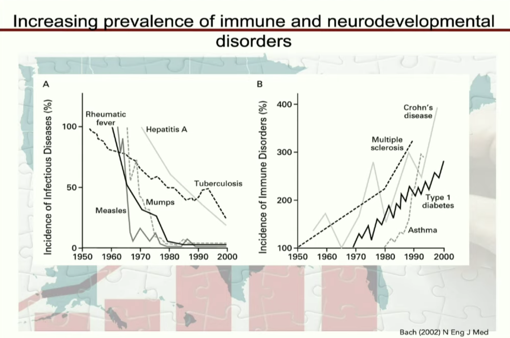
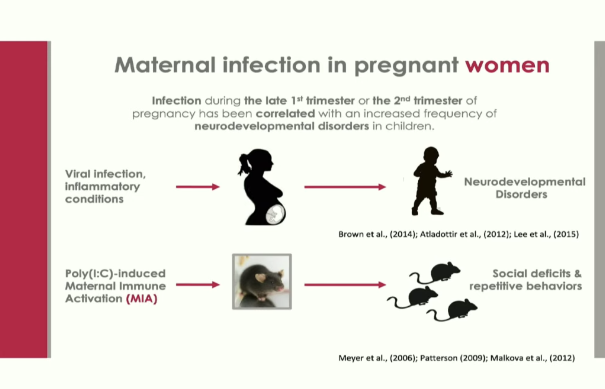

# Introduction:
* Cytokines based on genetic or enviornmental backgrounds can have ameliorating effects on behavior (e.g., fever reduces symptoms in ASD)
* what has driven rapid increase in immune disorders (e.g., crohn's diease, MS, asthma, type 1 diabetes) - are there non-genetic (environmental factors) contributing to these immune disorders?
* increasing prevelence of neurodevelopmental disorders as well (e.g., ASD). this rapid increase can't explained by genetic mutation alone.
* What are the environmental factors - gut bacteria, immune cells, neurons?

{fig-align="center"}

# Pregnancy and Maternal Immune System
* fetus is a foreign body to the maternal immune system
* maternal immune system must protect both the mother and fetus
* when this doesn't work properly, there will be longlasting effects on the fetus
* infecton during the late 1st trimester or 2nd trimester of pregnancy has been correlated wtih an increased frequency of neurodevelopmental disorders in children
* viral infection - inflammatory conditions - data on covid-19 during pregnancy: severity of maternal illness - might be increase in ASD in the future based on COVID infection
* we need to study more what is happening during pregnancy and long lasting effects: not enough people studying this question
* overlap between ASD children and IBD - common venn diagram of immune responses

{fig-align="center"}

{fig-align="center"}

# Mouse studies
* MIA offspring show increased susceptibility to bacteria-induced colitis
* increased immune susceptibility of MIA offspring are postnatally determined
* maternal gut bacteria: non-genetic contributors? free from bacteria in the womb and then we are exposed to bacteria immediately upon leaving the womb

