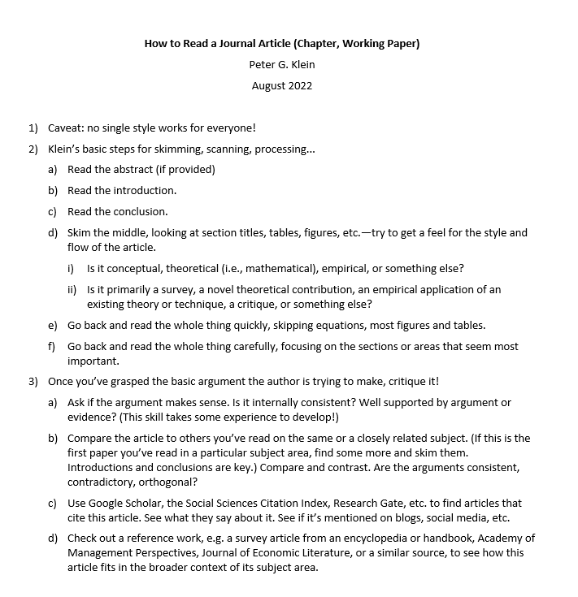

### First Steps
* Add your name to the team's [website](https://sensein.group/team/) through a pull request [here](https://github.com/sensein/sensein.github.io/blob/master/docs/_data/team_members.yml)
* Request access to [gablab slack](https://mit.enterprise.slack.com/signin/find-workspaces), look for workspace `Gablab`, request access, once you have joined, search for channel `#satralab`

### Group Meetings
* These are optional. You can attend remotely or in person.
* Sensein group meetings (PI: Satra Ghosh): Tuesdays from 1-3pm in rm 46-5165, [zoom link](https://mit.zoom.us/j/94441960929). Schedule is [here](https://docs.google.com/spreadsheets/d/1TI-prab_UZWEgz-Tgn01dEAiEXUwu2Cbo0Wg3oap1iA/edit?usp=sharing). **More relevent meeting**
* Gablab group meetings (PI: John Gabrieli): Fridays from 12-1pm in rm 46-5193, [zoom link](https://mit.zoom.us/j/92604776174)

### Work Expectations/Preferences
* Weekly updates on Friday mornings detailing (bullet point list): what you've done, what you're planning, any questions/blockers - can send via slack or email. 
* You can work in-person (46-5094) or remotely, whichever you prefer.
* Bimonthly meetings (or weekly if you prefer) - could do one hour meetings every two weeks or 30 min meetings every week
* End of summer write-up: present summary of what you researched at the end of the semester
* Fill out [mentorship agreement](https://docs.google.com/document/d/11-YwvIdT35Qg0uNtHOTi5Hje1feyRdoV/edit?usp=sharing&ouid=110847987931723045299&rtpof=true&sd=true) within 15 days of starting

### Technical Onboarding

## Doing Research
* Shell, git and other useful skills: https://missing.csail.mit.edu/ 
* python, stats, machine learning, deep learning, nlp: Daniel's resources [here](https://docs.google.com/document/d/127Npk6Z2gV-p_ewwnRz7qDyvKKRI6vb6Yg3zKnOw16s/edit)
* For tips on writing a good research paper (should also be helpful in reading papers too), see [Mensch & Kording's paper](https://journals.plos.org/ploscompbiol/article?id=10.1371/journal.pcbi.1005619).
* For guidelines on how to quickly and efficiently read a research paper
* [questions](https://docs.google.com/document/d/1C0BIUCnRUMB4GxSYUCGDSiff4WHgi4aK1XJ11zEYIjM/edit?usp=sharing) you can ask yourself as you're reading a paper
{fig-align="center"}

## OpenMind: cluster where we store data and run scripts
* Request openmind account + do course to get access and post certificate on [OpenMind github](https://github.mit.edu/MGHPCC/OpenMind/wiki/Getting-started)
    * Account Request Example: Attn @s-b,@djarecka: "maedbh maedbh@mit.edu" PI: Satrajit Ghosh
    * Verify which groups you're part of on openmind by typing `groups`: you should see `om_sig` and `gablab`. `om_sig` is Satra Ghosh's group and `gablab` is John Gabrieli's group.
* Follow instructions on [openmind setup](openmind.md) for getting starting on openmind (bash scripts etc.)
    * [openmind website](https://openmind.mit.edu/): this provides generic pointers to various elements of openmind, the link to FAQs is particularly useful.

## Projects:
* [Item analysis of questionnaires](../projects/item_analysis.md)