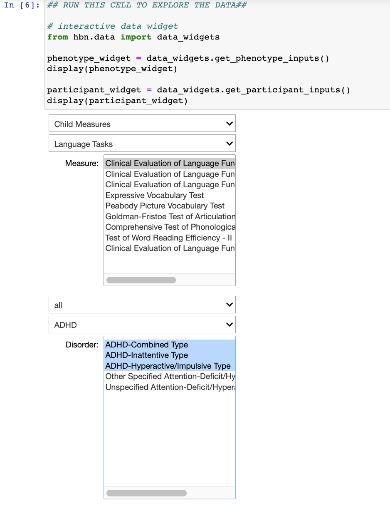

* ADHD project: waiting to get Biobank access to phenotypic data so that we can explore which professions adults with ADHD gravitate towards, in order to infer adaptive traits and attributes in this population. We also want to assess the modulating factors of race, gender, and SES on this question. I presented an [exploratory notebook on ADHD](../notebooks/exploratory-features-adhd.ipynb) from the HBN dataset. Some take-aways:
    * significantly  more males are diagnosed with ADHD than females. M/F ratio is smallest however for inattentive subtype
    * On average, children with ADHD have comorbidites and on average girls have slightly more than boys
    * Girls with inattentive ADHD start puberty earlier than other ADHD subtypes (+ children without an ADHD diagnosis)
    * very few children (<15%) are diagnosed with a learning disorder
    * 50-60% of children with ADHD have individualized education plan compared with 20% of children without a diagnosis
    * surprisingly, very few (<1%) of children diagnosed with adhd have parents who also have a diagnosis of adhd. This figure is much lower than expected based on existing literature, therefore, likely that more parents have adhd (but have not received a formal diagnosis) or the reporting is incomplete.
* set up a data exploration notebook that uses python widgets to explore the different measures (e.g., questionnaires) from the HBN across different diagnoses
{fig-align="center"}
* worked on CHOP [project proposal](https://docs.google.com/document/d/1CzxTSEouYnGT0CYMLGUu2MB_hBWzjMqXCRwUsE_4jzg/edit?usp=sharing)