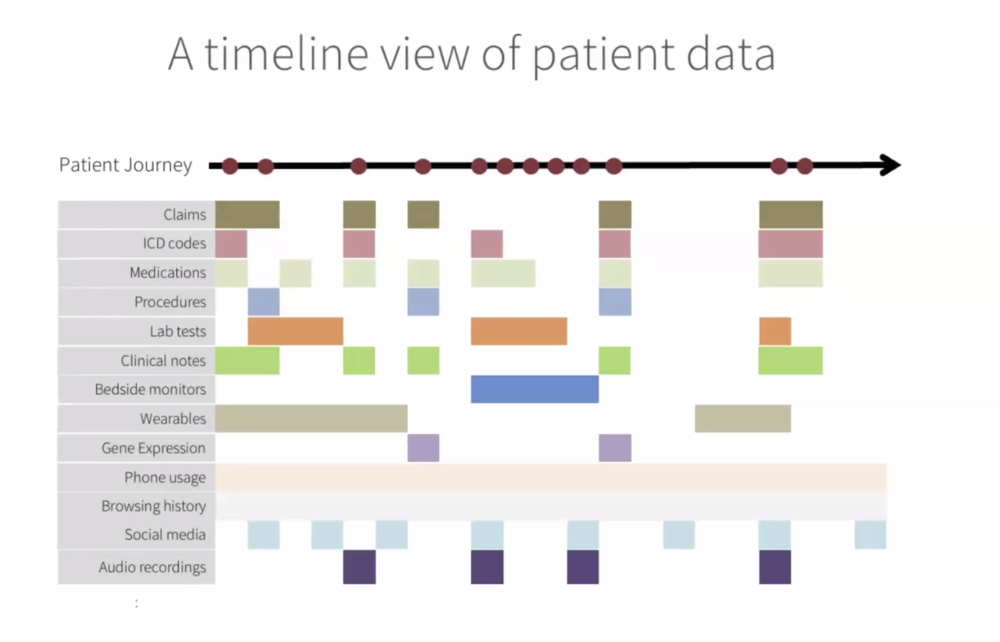
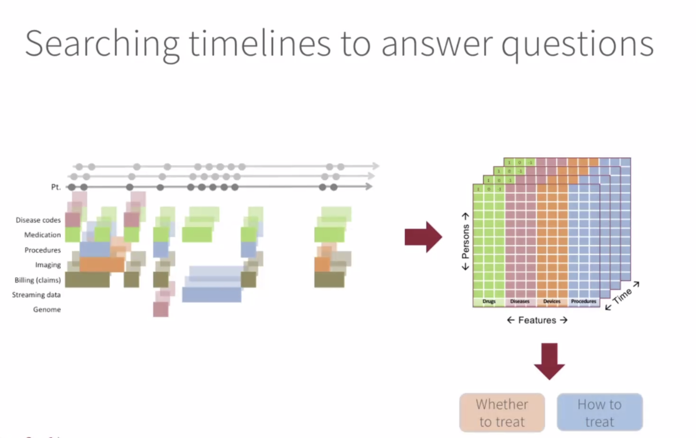

### Thomas Insel Opening Remarks
* The road to better theraputics runs through better diagnostics

#### Deconstructing diagnosis: 
* ML gives us the tools to deconstruct diagnosis: from dsm consensus to data-driven biotypes
    * what are the risks? should be hypothesis-generated, huge opportunity for false discovery - we should be a little skeptical
    * some examples: EMBARC - sertraline vs placebo (n=300), preRx variables as predictors.
    * EEG predicts who will respond to an antidepressant vs. placebo.
    * EEG markers may have relevence across disorder categories. EEG - lots of potential, could be housed in primary care offices. 
* What are the tools that can be used in an ER, primary care office? 
    * EEG is one such tool
    * fMRI will never do that 
* Digital phenotyping
    * getting information from devices that we're using, phones often know more about us than we know about ourselves
    * ability to use voice and speech
* Tying precision medicine to treatment
    * Alto's suite of biomarkers segment patients: from stratification to drug development
    * power in improving diagnosis but also therapeutics
* Psychiatry: new day for developing therapeutics, rather than just diagnosis
* Overall   
    * Deconstructing diagnosis: from clinical consensus to stratification
    * diagnosis from singular to multiplexed approaches based on biological, cognitive/behavioral, clinical, social data
    * precision psychiatry goes beyond stratification/personalization to treatment development
    * precision psychiatry: better diagnosis leads to better therapeutics resulting in better outcomes
* 2030 era: in an era we will using different labels for psychopathology and different therapeutics

**We're not very good at matching the treatments we have to the individuals who need them**

#### Why have we done so badly when we have so much good stuff to offer? 
* pnemounia problem: treating everyone with the same thing
* mental illness: most people who should and could be in care aren't. 
* we don't see people until they're in crisis
    * in contrast to other parts of medicine, the people we take care of are harder to treat (often treated against their free will, unlike cardiac patients)
    * the model we've used is not working (works well in infectious diaseae, oncology)
    * we need a mdoel that goes beyond symptom and relief. 
    * best model is orthopedic: break a leg, bone reset, and then years of therapy
    * patient has a pschotic break - they get acute care but no rehabilitation care. we know what's powerful (programs, mentorship care) - but that type of value-based care doesn't happen.
    * we have to start paying for the things that work - by doing that, we can save a lot of money, people won't be rehospitalized, as long as they have social support, safe place to live
    * don't do away with medical model, but we need to add on recovery model for mental illness
    * mental illness is a medical problem that requires a social solution
    * our house is on fire and you're telling us about the chemistry of the paint
    * people, place, purpose, and prevention
* what is the role of the different stakeholders? 
    * project warpspeed: public/private venture
    * can't get to scale as an academic
    * need to have time bounded projects: need to have goals by x date. people will be held accountable for results - that's the world we should be in. 
    * thomas insel: frustrated by how slow it's been - implementation cycle has been a failure. we hould at least be implementing the therapeutics we had from the 1990s.

#### Policy Changes/Companies
* future proofing project (australia):
    * tools for future proofing (social and emotional learning) 
* diatic care: california
    * family visits instead of baby visits, preventive care to mitigate adverse childhood experiences
    * aggressive care for people after first-episode psychosis (governer leadership)
* precision medicine companies: Alto neuroscience, compass pathways, humanest care, koko, karuna therapeutics

### Leveraging Healthcare Data (Lea Davis - Vanderbilt)
* studying genomics of complex phenotypes
* levaraging heterogeneity and comobordity in a real-world care setting

#### psycheMERGE:
* EHR data available linked with genotype samples (jordan smoller and chris de brie)
* 21 sites and affiliated partners
* built on an existing collaborative infrastructure (eMERGE)
* psycheMERGE focuses on mental illness
* instead of bringing data together, they bring scientists together - benefits: analyses can be scaled up quickly
* over 15 million EHRs
* over 950,000 genotyped patients
* average EHR ercord length year - 5 years
* average record length for genotyped patients - 12 years
* on average, 6 patient visits per year
* structure of healthcare in the US
    * primary care (health promotion, counseling, eduation)
    * secondary care (assessment, screening to facilitate early detection)
    * teriatry: treatment and management of chronic complex disease
* what is included in EHR? 
    * billing codes (reason for clinical visit)
    * note between provider and patient
    * narrative notes
    * medications
    * ER visits
    * labs and pathology
    * inpatient visits
* health record is very dynamic - always being updated. behind the structure is a human process. 
* breadth and depth of EHR data provide a unique view into a lifetime of comorbidities (particular for patients with psychiatric illness)

#### phenomone-wide association study
* take advanttage of breadth of EHR data
* polgenic risk score for schizophrenia
    * this score was strongly associated with schizophrenia
    * translational sandbox: how well does this genetic tool perform in a clinical pop? 
    * phenotypes from EHR can be interrogated using polygenic scores
* can we use lab data to identify potential biomarkers that link genetic risk to mental health conditions and related outcomes? 
    * qualityLab and LabWAS - > 1 billion lab observations comprised of 11,000 labs
    * take genetic risk scores - identify them in individuals - and then test whether those genetic scores are associated with routinely collected labs

#### Take home messages
* mental health is not biologically separable from physical health
* mental health can have independent effects on physical health and we don't appreciate enough how the reverse is also true
* 360 - coordinated care improves mental and physical outcomes - power of whole-person care
* genetics allows for a relationship between biology and mental health (e.g., depression + cardiovascular disease story) - biological relationship here (lens of genetics) - co-treatment of both can lead to improved outcomes
* psychiatry is underrepresented in primary care settings

### Nigam Shah
* Leveraging healthcare data for precision medicine and psychiatry
* think of data as a timeline view (a live thing)
* using patient timeline objects to provide better care

{fig-align="center"}

{fig-align="center"}

#### Green Button project: 
* given a specific case, provide a usmmary of similar patientss in stanfords clinical data warhouse - common treatmnt choices made, and observed outcomes
* green button = the idea
* consultation service = the execution of that idea at Stanford
* "what happened to other patients like me?"
* engineers, technocrats ask "how" quetions? 
* if you want to make an impact, ask a "why" question?
* how do we get patients to the table more readily? 

### speaker?? - Inverting model of data sharing
* traditional approach:
    * data sharing = data copying
    * few audit controls
    * huge infrastructure needed
    * siloed compute - well resourced place
    * need for elastic computing patterns
* cloud-centric approach:
    * bring researchers to the data
    * this is the goal of the broad data sciences platform
    * organization of more than 250 software engineers and ML experts
* Tools: terra (microsoft, broad, verily) - data platform for biomedicine

### Laura Germine
* how do we make research studies more accessible? 
    * minimze barriers to participation
    * respect the participant's time
    * make the study relevent to people's goals and interets by return of individual-level research results
    * individualized results as psychoeducation
* covid and the accessibility crisis
    * new tools for collecting data online
    * how do we get to scale? what tools do most people have - smartphones